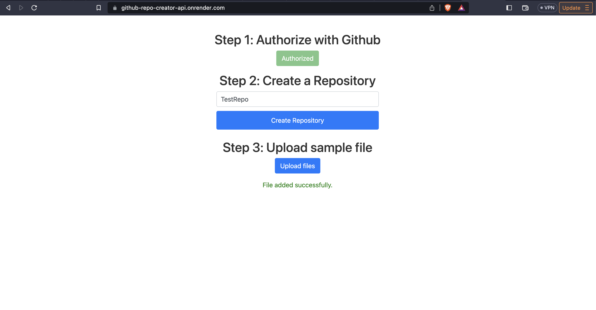
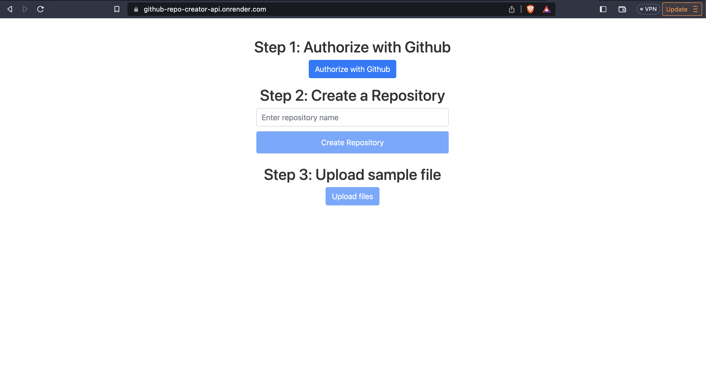

<p align="center">
  <a href="http://nestjs.com/" target="blank"></a>
</p>

[circleci-image]: https://img.shields.io/circleci/build/github/nestjs/nest/master?token=abc123def456
[circleci-url]: https://circleci.com/gh/nestjs/nest

  <p align="center">A progressive <a href="http://nodejs.org" target="_blank">Node.js</a> framework for building efficient and scalable server-side applications.</p>
    <p align="center">
<a href="https://www.npmjs.com/~nestjscore" target="_blank"></a>
<a href="https://www.npmjs.com/~nestjscore" target="_blank"></a>
<a href="https://www.npmjs.com/~nestjscore" target="_blank"></a>
<a href="https://circleci.com/gh/nestjs/nest" target="_blank"></a>
<a href="https://coveralls.io/github/nestjs/nest?branch=master" target="_blank"></a>
<a href="https://discord.gg/G7Qnnhy" target="_blank"></a>
<a href="https://opencollective.com/nest#backer" target="_blank"></a>
<a href="https://opencollective.com/nest#sponsor" target="_blank"></a>
  <a href="https://paypal.me/kamilmysliwiec" target="_blank"></a>
    <a href="https://opencollective.com/nest#sponsor"  target="_blank"></a>
  <a href="https://twitter.com/nestframework" target="_blank"></a>
</p>
  <!--[](https://opencollective.com/nest#backer)
  [](https://opencollective.com/nest#sponsor)-->

## Description

[Nest](https://github.com/nestjs/nest) framework TypeScript starter repository.

## How to 
To create a repository, follow 3 simple steps and it will create a 
repository with a sample file in it.

1. Authorize with Github (Just like Google, Facebook etc.)
2. Enter Repository name in the text box and wait for popup "Repository created successfully."
3. Once Repository is created, Upload sample file. (The sample fie is currently hardcoded 
at the backend but can be uploaded from frontend side just need to create a route for that - left that for future scope)

All the route information can be found in ```github.controller.ts``` file.

## Deployment
URL: https://github-repo-creator-api.onrender.com/

**NOTE:** Sometime the site takes longer to load due to initialization time as it is a free tier the server goes to 
idle state when unused for several hours.

Both frontend and backend are deployed on same origin using ```app.useStaticAssets(join(__dirname, '../../frontend').toString());``` method of express.

## Screenshots
When Authorized             |  When Unauthorized
:-------------------------:|:-------------------------:
   |  


## Dependencies used
Database used is: ```sqlite3``` with ```typeorm```
```json
    "@nestjs/common": "^10.0.2",
    "@nestjs/config": "^3.0.0",
    "@nestjs/core": "^10.0.2",
    "@nestjs/jwt": "^10.1.0",
    "@nestjs/passport": "^10.0.0",
    "@nestjs/platform-express": "^10.0.3",
    "@nestjs/typeorm": "^10.0.0",
    "@octokit/rest": "^19.0.13",
    "class-transformer": "^0.5.1",
    "class-validator": "^0.14.0",
    "core-js": "^3.31.0",
    "cors": "^2.8.5",
    "passport": "^0.6.0",
    "passport-github": "^1.1.0",
    "passport-jwt": "^4.0.1",
    "rxjs": "^7.8.1",
    "typeorm": "^0.3.17"
```


## Installation

```bash
$ npm install
```

## Running the app

```bash
# development
$ npm run start

# watch mode
$ npm run start:dev

# production mode
$ npm run start:prod
```

## Test

```bash
# unit tests
$ npm run test

# e2e tests
$ npm run test:e2e

# test coverage
$ npm run test:cov
```
